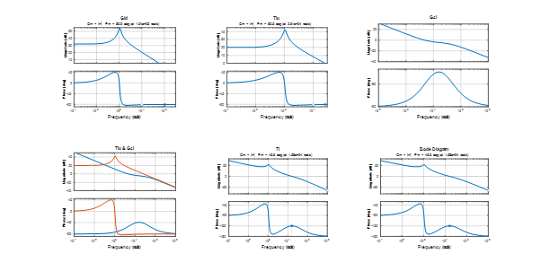

# Non-isolated Converters

A comprehensive collection of non-isolated DC-DC power converter designs, control algorithms, and implementations. This repository contains MATLAB/Simulink simulations, DSP code implementations, and hardware prototypes for Buck and Boost converters with advanced control strategies.


## Overview

This project focuses on the design and implementation of non-isolated DC-DC converters with emphasis on:

- **Double-loop control systems** (voltage and current control)
- **Passive feedforward compensation**
- **Terminal impedance shaping**
- **Stability analysis** for constant power loads (CPL)
- **Hardware prototyping** and validation

## Project Structure

```
NonisolatedConverters/
├── BoostConverter/
│   ├── DSPCodes/              # Digital Signal Processor implementation
│   ├── Figures/               # Control loop diagrams and analysis plots
│   ├── MatlabSimulations/     # MATLAB/Simulink models and design codes
│   └── Prototype/             # Hardware prototype files
├── BuckConverter/
│   ├── DSPCodes/              # DSP implementation for Buck converter
│   ├── MatlabSimulations/     # MATLAB simulation files
│   └── Prototype/             # Hardware prototype documentation
├── LICENSE.md                 # Creative Commons License
└── README.md                  # This file
```

## Features

### Boost Converter
- **Double-loop control design** with inner current loop and outer voltage loop
- **PI controller optimization** for both control loops
- **Passive feedforward compensation** for improved transient response
- **Terminal impedance analysis** and shaping techniques
- **Stability assessment** for constant power load interactions
- **MATLAB/Simulink models** for simulation and validation

### Buck Converter
- Structured framework for Buck converter control design
- Modular approach for easy extension and modification
- Compatible control architecture with Boost converter implementation

## Key Algorithms

1. **Double-Loop Control Design**
   - Inner current control loop for fast transient response
   - Outer voltage control loop for regulation accuracy
   - Systematic design methodology based on converter small-signal models

2. **Passive Feedforward Compensation**
   - Improves load transient response
   - Reduces output voltage deviation
   - Maintains system stability margins

3. **Terminal Impedance Shaping**
   - Prevents negative impedance interactions
   - Ensures stability with constant power loads
   - Nyquist stability criterion implementation

## Simulation and Analysis

The MATLAB simulation files provide:
- **Bode plots** for frequency response analysis
- **Nyquist plots** for stability assessment
- **Step response** analysis for transient performance
- **Impedance analysis** for system interaction studies

### Key Files:
- `BoostConverterPassiveControlDesignCodes.m` - Main control design script
- `BoostConverterDoubleLoopControl.slx` - Simulink model for double-loop control
- `BoostConverterPassvieFeedbackControl.slx` - Passive feedback control simulation

## Getting Started (Boost Conveter Example)

### Prerequisites
- MATLAB R2018b or later
- Simulink
- Control System Toolbox
- Signal Processing Toolbox (for DSP implementation)

### Running Simulations
1. Clone this repository
2. Navigate to `BoostConverter/MatlabSimulations/`
3. Run `BoostConverterPassiveControlDesignCodes.m` for control design
4. Open `.slx` files in Simulink for time-domain simulations

### Hardware Implementation
- DSP code directories contain implementation-ready code
- Prototype folders include hardware design files and documentation
- Refer to individual converter folders for specific implementation details

## Results and Performance

The implemented control strategies achieve:
- **Fast transient response** with minimal overshoot
- **Excellent steady-state regulation** (< 1% error)
- **Robust stability margins** (> 45° phase margin, > 6 dB gain margin)
- **Effective impedance shaping** for CPL stability



## Related Papers
- **F. Li and Z. Lin,** "Novel Passive Controller Design for Enhancing Boost Converter Stability in DC Microgrid Applications," *IEEE Journal of Emerging and Selected Topics in Power Electronics*, vol. 9, no. 6, pp. 6901-6911, Dec. 2021, doi: [10.1109/JESTPE.2021.3070234](https://doi.org/10.1109/JESTPE.2021.3070234).

## Author

**[Fulong Li](https://fulongli.github.io/)** - *Loughborough University, 2020*

## License

This project is licensed under the **Creative Commons Attribution 4.0 International License (CC BY 4.0)** - see the [LICENSE.md](LICENSE.md) file for details.

**Copyright © 2019–2022 Fulong Li**

## Contact

For questions, collaborations, or technical discussions, please contact:
- **Email:** fulong.li@ieee.org
- **Website:** [https://fulongli.github.io/](https://fulongli.github.io/)
